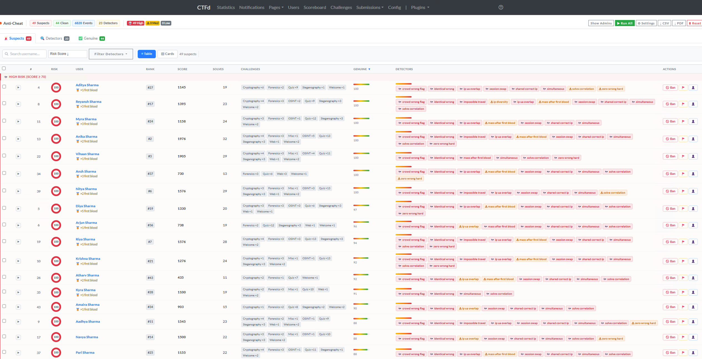
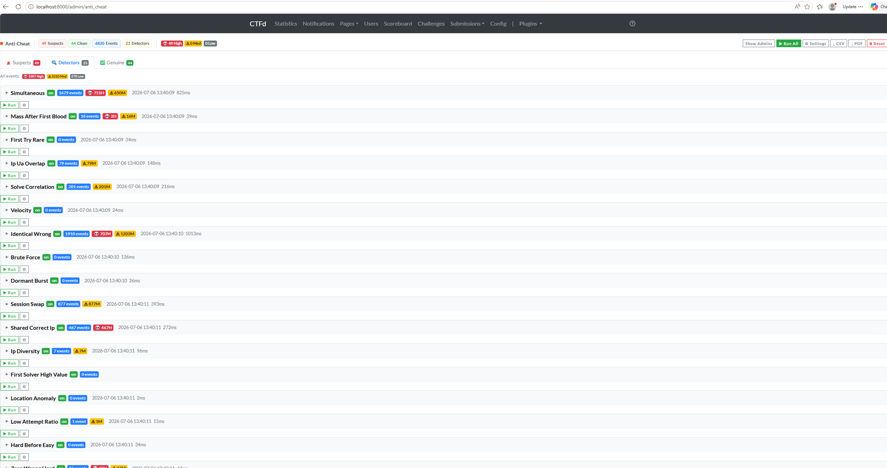
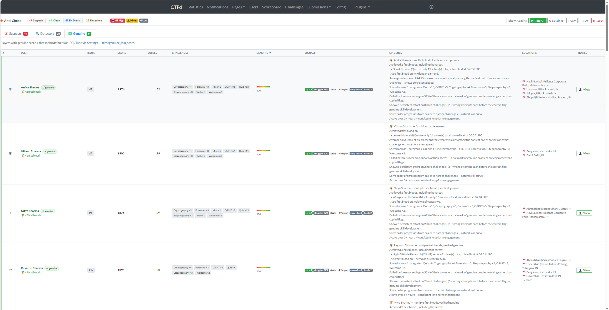

# CTFd Anti-Cheat

> Admin-only CTFd plugin that detects cheating patterns, scores suspicion per user, and validates genuine players — built for virtual CTF competitions where manual oversight doesn't scale.

**20+ detection heuristics** · **Team & User mode** · **Genuine player verification** · **CSV/PDF export** · **Zero external API calls**

---

## Screenshots

> **Note:** The data shown below was imported from a real CTF competition. All participant names have been replaced with dummy names for privacy and security purposes.

### Suspects Dashboard — Risk-tiered suspect list with detector badges and one-click banning


### Detectors Tab — 23 detectors with event counts, severity breakdown, and run times


### Genuine Players — Verified clean players with evidence narratives and geo-locations


---

## Table of Contents

- [Screenshots](#screenshots)
- [Why This Exists](#why-this-exists)
- [Features](#features)
- [Detection Heuristics](#detection-heuristics)
- [Genuine Player Verification](#genuine-player-verification)
- [Installation](#installation)
  - [Docker (Recommended)](#docker-recommended)
  - [CTFd Cloud Enterprise](#ctfd-cloud-enterprise)
  - [Manual / Bare Metal](#manual--bare-metal)
- [Quick Start](#quick-start)
- [Configuration](#configuration)
  - [Tuning Thresholds](#tuning-thresholds)
  - [Disabling Individual Detectors](#disabling-individual-detectors)
  - [Team Mode](#team-mode)
- [Security](#security)
- [Export & Reporting](#export--reporting)
- [Investigation Playbook](#investigation-playbook)
- [Adding a Custom Detector](#adding-a-custom-detector)
- [File Structure](#file-structure)
- [Uninstall](#uninstall)
- [Requirements](#requirements)
- [Contributing](#contributing)
- [License](#license)

---

## Why This Exists

Virtual CTF competitions are vulnerable to flag sharing, multi-accounting, IP swapping, coordinated submissions, and dozens of other integrity attacks. Detecting these manually across hundreds or thousands of participants is not practical.

This plugin automates detection across 20+ heuristics, aggregates findings into per-user risk scores, and — equally important — builds evidence profiles for genuine players so organizers can confidently validate their standings.

---

## Features

- **20+ detection heuristics** covering temporal, behavioral, network, and statistical patterns
- **User Mode & Team Mode** — works in both CTFd configurations; team-mode detectors catch inter-team collusion
- **Genuine player scoring** — first bloods, progressive difficulty, category diversity, struggle signals, and more
- **Risk-tiered dashboard** with drill-down modals, sortable tables, and one-click banning
- **CSV and PDF export** ranked by CTF standing for competition reports
- **Fully configurable** — every threshold adjustable from the admin Settings page at runtime
- **Security hardened** — CSRF enforcement, input validation, XSS-safe rendering, path traversal protection
- **Zero external network calls** — all analysis runs locally against your CTFd database
- **Clean install/uninstall** — all plugin tables prefixed `cm_`, no modifications to CTFd core tables

---

## Detection Heuristics

### User-Mode Detectors

| # | Detector | What It Finds | Default Severity |
|---|----------|---------------|-----------------|
| 1 | `simultaneous` | Two users solve the same challenge within seconds of each other (tiered: HIGH <30s, MED <120s, LOW <300s) | 30–95 |
| 2 | `mass_after_first_blood` | User solves many challenges suspiciously fast after someone else got first blood | 50+ |
| 3 | `first_try_rare` | First submission is correct on a low-solver-count challenge with zero prior failed attempts | 35–100 |
| 4 | `ip_ua_overlap` | Multiple distinct accounts share the same IP address (and User-Agent if UA logging is enabled) | 45–60 |
| 5 | `solve_correlation` | Two users solve the same set of challenges in nearly the same order (concordant-pair analysis) | 55+ |
| 6 | `velocity` | Per-user solve rate exceeds 3 standard deviations above the cohort mean | 30+ |
| 7 | `identical_wrong` | Two or more users submit the exact same wrong flag string | 40+ |
| 8 | `brute_force` | 30+ failed submissions on one challenge within a 2-minute window | 25 |
| 9 | `dormant_burst` | Account silent for 12+ hours, then bursts 5+ solves within 30 minutes | 30 |
| 10 | `session_swap` | Same IP+UA fingerprint used by two different accounts within 5 minutes | 40–50 |
| 11 | `shared_correct_ip` | Multiple accounts submit a correct flag for the same challenge from the same IP | 80+ |
| 12 | `ip_diversity` | A single account submits from an unusually large number of distinct IPs | 30+ |
| 13 | `first_solver_high_value` | First solver on a high-value challenge with zero prior failed attempts | 65+ |
| 14 | `location_anomaly` | User IPs originate outside configured allowed regions (requires geo database) | 60+ |
| 15 | `low_attempt_ratio` | Many correct solves but suspiciously few wrong attempts — flags likely received directly | 60+ |
| 16 | `hard_before_easy` | First N solves are all hard challenges with zero attempts on easy ones | 60 |
| 17 | `zero_wrong_hard` | Multiple hard challenges solved with exactly zero prior wrong attempts | 65+ |
| 18 | `impossible_travel` | Submissions jump between geographically distinct IPs within a short time window | 70 |
| 19 | `banned_activity` | Already-banned user still has solve records on the leaderboard | 95 |
| 20 | `crowd_wrong_flag` | Same wrong flag submitted by 10+ users — coordinated group discussion | 65+ |

### Team-Mode Detectors

These activate automatically when CTFd is configured in Team Mode.

| # | Detector | What It Finds | Default Severity |
|---|----------|---------------|-----------------|
| 21 | `inter_team_ip_sharing` | Different teams sharing the same IP address (same-team sharing is expected) | 70 |
| 22 | `inter_team_flag_sharing` | Members of different teams solving the same challenge within seconds from the same IP | 80 |
| 23 | `team_solve_correlation` | Two teams have highly correlated solve orders | 60+ |

---

## Genuine Player Verification

The plugin doesn't just catch cheaters — it actively builds evidence profiles for legitimate players. Each user gets a genuine score (0–100) based on:

| Signal | What It Measures | Max Points |
|--------|-----------------|------------|
| First bloods | Earliest solver on one or more challenges | 40 |
| Rare first bloods | First blood on challenges with very few total solvers | 20 |
| Average solve rank | Consistently among the earliest solvers across all challenges | 20 |
| Category diversity | Solves spanning multiple challenge categories | 20 |
| Prior failures | Failed before succeeding — genuine problem-solving behavior | 25 |
| Participation span | Active over many hours — consistent, paced engagement | 15 |
| Consistent IP | Stable session with 1–2 source IPs | 10 |
| High-value solves | Solved a challenge worth 400+ points | 5 |
| Progressive difficulty | Solve order trends from easy to hard — natural skill curve | 10 |
| Unique wrong guesses | Wrong answers are personal/exploratory, not crowd-sourced | 10 |
| Hard struggle | 5+ wrong attempts before success on hard challenges | 15 |

A user with suspicion 60 and genuine 80 is probably a strong solo player. A user with suspicion 60 and genuine 10 is the one to investigate.

---

## Installation

### Docker (Recommended)

```bash
# From your CTFd project root
git clone https://github.com/zuberexe/ctfd-anti-cheat.git CTFd/plugins/ctfd_anti_cheat

# Install the PDF export dependency
docker compose exec ctfd pip install reportlab>=4.0

# Restart to load the plugin
docker compose restart ctfd
```

Visit `http://your-ctfd-instance/admin/anti_cheat` as an admin.

### CTFd Cloud Enterprise

1. Download the latest release `.zip` from the [Releases](https://github.com/zuberexe/ctfd-anti-cheat/releases) page
2. In CTFd Admin Panel → **Plugins** → **Upload**
3. Upload the zip file — it contains a single `ctfd_anti_cheat` top-level directory
4. The plugin will be submitted for review. You'll be notified when approved

### Manual / Bare Metal

```bash
# Copy the plugin directory
cp -r ctfd_anti_cheat /path/to/CTFd/CTFd/plugins/

# Install dependencies
pip install -r /path/to/CTFd/CTFd/plugins/ctfd_anti_cheat/requirements.txt

# Restart CTFd
systemctl restart ctfd   # or however you manage your CTFd process
```

---

## Quick Start

1. **Install** the plugin using one of the methods above
2. **Navigate** to `/admin/anti_cheat` in your browser (admin login required)
3. **Click "Run All Detectors"** — for ~1000 users / ~10k submissions, expect detection to finish in a few seconds
4. **Review the Suspects tab** — users are ranked by suspicion score with color-coded risk tiers
5. **Check the Genuine tab** — verified clean players with evidence narratives
6. **Export** CSV or PDF reports for your records

### First-time setup with test data

```bash
# 1. Clone CTFd
git clone https://github.com/CTFd/CTFd.git && cd CTFd

# 2. Drop the plugin in
git clone https://github.com/zuberexe/ctfd-anti-cheat.git CTFd/plugins/ctfd_anti_cheat

# 3. Boot
docker compose up -d

# 4. Complete initial setup at http://localhost:8000/setup

# 5. Import your CTF backup (Admin → Config → Backup → Import)
#    OR generate some challenges and users for testing

# 6. Browse to http://localhost:8000/admin/anti_cheat
#    Click "Run All Detectors"
```

---

## Configuration

### Tuning Thresholds

All thresholds are configurable from the admin Settings page at `/admin/anti_cheat/config`. Changes persist in the database and survive restarts.

You can also edit defaults in `utils.py` → `DEFAULTS` dict before first load.

**Key thresholds you'll most likely want to adjust:**

| Key | Default | When to Change |
|-----|---------|----------------|
| `simul.high_conf_sec` | 30 | Lower for short CTFs; raise for relaxed jeopardy events |
| `simul.low_conf_sec` | 300 | Upper bound of the simultaneous-solve detection window |
| `mass_fb.ratio_pct` | 20 | Lower = stricter (catches more flag-passers, fewer false positives) |
| `rare.max_solver_count` | 5 | Lower for large CTFs (10k+ players), higher for small invitationals |
| `overlap.min_accounts` | 2 | Set to 3+ for audiences on shared NAT (universities, hotels) |
| `corr.order_match_pct` | 80 | Below 70 generates noise; above 90 misses softer collusion |
| `velocity.zscore` | 3.0 | 2.5 catches more but noisier; 4.0 only the most blatant outliers |
| `filter.genuine_min_score` | 50 | Lower to show more players in the Genuine tab; raise for stricter verification |
| `brute.failures` | 30 | Lower for CTFs with rate limiting; higher for open-submission events |

### Disabling Individual Detectors

**At runtime:** Set `enabled.<detector_name>` to `0` on the Settings page.

```sql
-- Or via database directly
UPDATE cm_config SET value='0' WHERE `key`='enabled.simultaneous';
```

**In code:** Comment out the detector's line in the `DETECTORS` dict at the bottom of `detectors.py`.

### Team Mode

Team-mode detectors activate automatically when CTFd is configured in Team Mode (`Admin → Config → User Mode → Teams`). No manual configuration needed.

In team mode, the plugin:
- Detects **inter-team** IP sharing (same-team sharing is expected and ignored)
- Flags cross-team correct submissions from the same IP within configurable time windows
- Analyzes team-level solve-order correlation

Team-mode thresholds are configurable under the `team_ip.*`, `team_flag.*`, and `team_corr.*` keys on the Settings page.

---

## Security

The plugin implements multiple layers of security hardening:

| Protection | Implementation |
|-----------|---------------|
| **CSRF** | Session nonce validation on all POST/PUT/PATCH/DELETE requests |
| **XSS** | HTML entity escaping in JSON output (`<`, `>`, `&`, `'` → Unicode escapes) + client-side `cmEsc()` on all innerHTML insertions |
| **Path traversal** | Static asset filenames validated against strict allowlist regex |
| **Input validation** | All config values sanitized — booleans forced to 0/1, numerics clamped to valid ranges, strings stripped of dangerous characters |
| **SQL injection** | SQLAlchemy ORM throughout — no raw SQL |
| **Detector name validation** | Only names present in the DETECTORS registry are accepted |
| **Security headers** | `X-Content-Type-Options: nosniff`, `X-Frame-Options: DENY`, `Referrer-Policy: strict-origin-when-cross-origin` |
| **Access control** | All routes protected by CTFd's `admins_only` decorator |
| **Input length limits** | Config values capped at 500 chars, UA strings at 500 chars, IP strings at 45 chars |

---

## Export & Reporting

### CSV Export

Click **Export CSV** on the dashboard. The file includes:

- **Suspects section** — rank, username, CTF rank/score, solve count, categories, first bloods, suspicion score, genuine score, detectors triggered, locations, narrative
- **Genuine Users section** — same fields with evidence narrative

Sorted by CTF rank (top-ranked first).

### PDF Export

Click **Export PDF** for a formatted report with:

- Cover heading with timestamp and summary counts
- Color-coded suspect table with primary reason column
- Genuine players table with evidence summary
- Landscape A4 layout optimized for printing

Requires `reportlab>=4.0` (listed in `requirements.txt`).

---

## Investigation Playbook

The dashboard tells you **who** to look at. This playbook tells you **how**.

### Tier 1 — Sanity Check (5 min per suspect)

1. Open the **user detail page** (`/admin/anti_cheat/user/<id>`). Read each event's detail.
2. Check the **genuine score**. Score ≥60 with moderate suspicion (40–60) usually = strong solo player.
3. Check the **failure ratio**. Below 0.1 across many solves is the strongest "they didn't actually try" signal.

### Tier 2 — Corroboration (15 min)

4. Cross-reference `ip_ua_overlap` peers with registration email domains and `solve_correlation` peers. Matching all three = confirmed multi-account.
5. Pull CTFd's Submissions table — look for wrong flags that match answers to *different* challenges (writeup copy-paste), or flag formats from other CTFs.
6. Check time-of-day distribution. A cluster at 3 AM local time for a daytime-active account is suspicious.

### Tier 3 — Proof (for disqualification)

7. Pull web server/proxy logs for suspect IPs around solve times. Look for concurrent sessions from different geographies, mismatched User-Agents, or `Referer` headers pointing to writeup sites.
8. If you use per-team dynamic flags, check which user's flag was actually submitted. Submitting someone else's dynamic flag is definitive collusion.
9. Compare session cookie issuance times between `session_swap` peers.

### Tier 4 — Communicate

10. **Always give the player a chance to explain** before disqualification. "We noticed X, can you walk us through your solve?" resolves edge cases (siblings on shared connections, etc.).
11. Keep an immutable export of the evidence for contested disqualifications.

### Common False Positives

| Pattern | Cause | How to Recognize |
|---------|-------|-----------------|
| `ip_ua_overlap` across many users | Shared NAT (university, corporate, hotel) | Check email domains — distinct organizations on same NAT |
| `mass_after_first_blood` spike on one challenge | Hint released publicly mid-CTF | Spike on single challenge across many users simultaneously |
| `first_try_rare` on day 2 morning | Writeup leaked between rounds | Not disqualifiable collusion — rotate your flags |
| `brute_force` with no eventual solve | Bot / scanner / scripted tool | Ban for ToS violation, not "collusion" |

---

## Adding a Custom Detector

```python
# In detectors.py — add your function:

def detect_your_thing():
    """Describe what this detector looks for."""
    events = []
    # ... your detection logic ...
    events.append({
        "detector":         "your_thing",
        "user_id":          user_id,
        "team_id":          None,           # set in team mode
        "related_user_id":  None,           # the other party, if applicable
        "challenge_id":     None,           # anchor challenge, if applicable
        "severity":         40,             # 0–100
        "detail":           "human-readable explanation",
        "occurred_at":      some_datetime,
    })
    return events

# Register it in the DETECTORS dict:
DETECTORS = {
    # ... existing detectors ...
    "your_thing": (detect_your_thing, "enabled.your_thing"),
}
```

Then add default config keys in `utils.py`:

```python
DEFAULTS = {
    # ... existing defaults ...
    "enabled.your_thing": "1",
    "your_thing.threshold": "10",
    "your_thing.severity": "40",
}
```

The dashboard, settings page, run button, score aggregator, and export functions all pick up the new detector automatically — zero further changes needed.

---

## File Structure

```
ctfd_anti_cheat/
├── __init__.py              # Plugin entry point — load(app), routes, blueprint, scoring
├── config.json              # CTFd plugin registration (name + admin menu route)
├── models.py                # Database models: cm_config, cm_suspicion_events,
│                            #   cm_ua_log, cm_run_meta
├── queries.py               # Read-only queries against CTFd core tables
│                            #   (user mode + team mode helpers)
├── detectors.py             # 23 detection functions + DETECTORS registry
├── utils.py                 # DEFAULTS table, config helpers, IP/UA fingerprinting,
│                            #   geo lookup, HTML-safe JSON serialization
├── requirements.txt         # reportlab>=4.0 (PDF export)
├── assets/
│   ├── monitor.css          # Dashboard styling (Bootstrap 4 integration)
│   └── monitor.js           # Client-side helpers
└── templates/anti_cheat/
    ├── dashboard.html        # Main dashboard — suspects, detectors, genuine tabs
    ├── user_detail.html      # Per-user investigation page
    └── config.html           # Settings / threshold editor
```

---

## Uninstall

```bash
# 1. Remove the plugin directory
rm -rf CTFd/plugins/ctfd_anti_cheat

# 2. Drop plugin tables from the database
docker compose exec db mysql -uroot -p<password> ctfd \
  -e "DROP TABLE IF EXISTS cm_suspicion_events, cm_config, cm_ua_log, cm_run_meta;"

# 3. Restart CTFd
docker compose restart ctfd
```

---

## Requirements

- **CTFd** 3.x (tested on 3.8.5+)
- **Python** 3.9+
- **reportlab** >= 4.0 (for PDF export only — install via `pip install reportlab`)
- No external API calls or network dependencies

---

## Contributing

Contributions are welcome! Here's how to get started:

1. **Fork** the repository
2. **Create a feature branch**: `git checkout -b feature/my-detector`
3. **Add your detector** following the pattern in [Adding a Custom Detector](#adding-a-custom-detector)
4. **Test** against a CTFd instance with sample data
5. **Submit a Pull Request** with a clear description of what your detector catches and its expected false-positive rate

### Ideas for contributions

- New detection heuristics (writeup-URL detection, flag format mismatch, time-zone anomaly)
- Dashboard enhancements (charts, timeline visualizations, network graphs)
- Integration with external services (Slack/Discord notifications, webhook alerts)
- Localization / i18n support
- Automated test suite with synthetic CTF data

---

## License

MIT License — see [LICENSE](LICENSE) for details.

---

**Built by [Zuber Vhora](https://github.com/zuberexe)** — born from three years of CTF organizing, built to ensure genuine participants get the recognition they earn.
